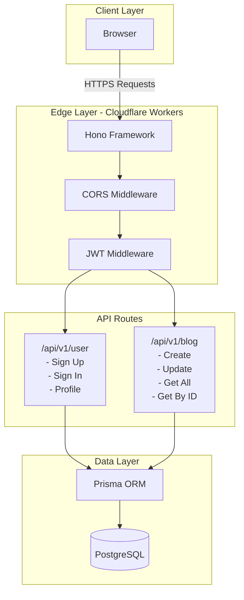
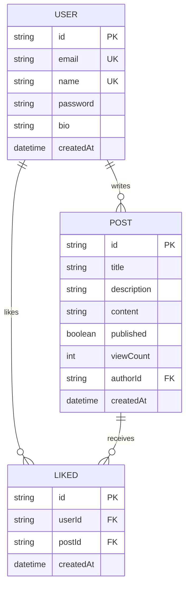
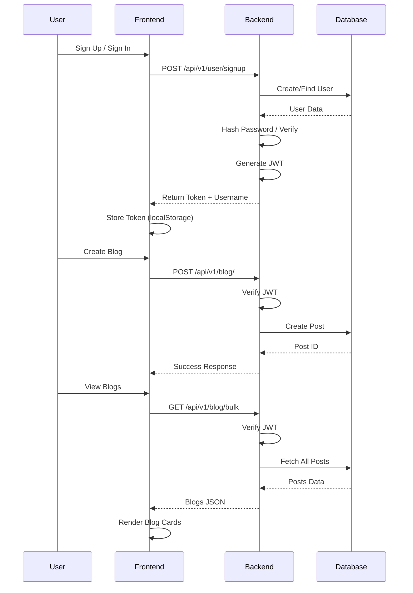
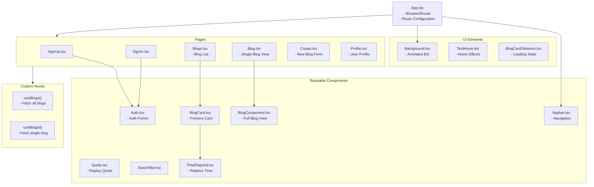

# Carve - Modern Blogging Platform

A full-stack blogging platform built with modern web technologies, featuring a clean UI, secure authentication, and seamless content creation.

## Features

### Core Features
- **User Authentication**: Secure sign-up and sign-in with JWT-based authentication and bcrypt password hashing
- **Create & Manage Blogs**: Write, edit, and publish blog posts with rich content
- **Blog Feed**: Browse all published blogs in a responsive feed layout
- **User Profiles**: View author profiles with bio and published posts
- **Responsive Design**: Mobile-first UI with Tailwind CSS and fluid layouts
- **Real-time UI**: Smooth animations powered by Framer Motion

### Technical Features
- **Type Safety**: Full TypeScript support across frontend and backend
- **Input Validation**: Zod schema validation for all API inputs
- **Secure API**: Protected routes with JWT middleware
- **Database Relations**: User-Post-Like relationships with Prisma ORM
- **Serverless Deployment**: Backend deployed on Cloudflare Workers

## Tech Stack

### Backend
- **Runtime**: Cloudflare Workers (Edge Computing)
- **Framework**: Hono (Lightweight web framework)
- **Database**: PostgreSQL with Prisma ORM
- **Authentication**: JWT tokens + bcryptjs
- **Validation**: Zod schemas (shared package)

### Frontend
- **Framework**: React 18 with TypeScript
- **Build Tool**: Vite
- **Styling**: Tailwind CSS with Fluid Tailwind
- **Routing**: React Router DOM v7
- **HTTP Client**: Axios
- **Animations**: Framer Motion

### Shared
- **Validation**: Zod schemas for type-safe API contracts
- **Package**: Published as `@cpt_skyfish_/carve-common`

## Architecture

### System Architecture



### Database Schema



### Application Flow



### Frontend Component Hierarchy



## API Endpoints

### User Routes (`/api/v1/user`)

| Method | Endpoint | Description | Auth Required |
|--------|----------|-------------|---------------|
| POST | `/signup` | Create new account | No |
| POST | `/signin` | Login existing user | No |
| GET | `/profile/:username` | Get user profile & blogs | Yes |

### Blog Routes (`/api/v1/blog`)

| Method | Endpoint | Description | Auth Required |
|--------|----------|-------------|---------------|
| POST | `/` | Create new blog post | Yes |
| PUT | `/` | Update existing blog | Yes |
| GET | `/bulk` | Get all blog posts | Yes |
| GET | `/:id` | Get single blog by ID | Yes |

## Getting Started

### Prerequisites
- Node.js 18+
- PostgreSQL database
- Cloudflare account (for deployment)

### Installation

1. **Clone the repository**
   ```bash
   git clone https://github.com/ajybr/Carve.git
   cd carve
   ```

2. **Install dependencies**
   ```bash
   # Install common package dependencies
   cd common && npm install
   
   # Install backend dependencies
   cd ../backend && npm install
   
   # Install frontend dependencies
   cd ../frontend && npm install
   ```

3. **Set up environment variables**
   
   Backend (`backend/.env`):
   ```env
   DATABASE_URL=your_postgresql_url
   DIRECT_URL=your_direct_postgresql_url
   JWT_SECRET=your_jwt_secret
   ```

4. **Set up the database**
   ```bash
   cd backend
   npx prisma migrate dev
   npx prisma generate
   ```

5. **Run the development servers**
   
   Backend:
   ```bash
   cd backend
   npm run dev
   ```
   
   Frontend:
   ```bash
   cd frontend
   npm run dev
   ```

## Deployment

### Backend (Cloudflare Workers)
```bash
cd backend
npm run deploy
```

### Frontend
Build the frontend for production:
```bash
cd frontend
npm run build
```

Deploy the `dist` folder to your preferred hosting platform (Vercel, Netlify, etc.)

## Environment Variables

### Backend
- `DATABASE_URL`: PostgreSQL connection string
- `DIRECT_URL`: Direct PostgreSQL connection for migrations
- `JWT_SECRET`: Secret key for JWT signing
- `saltRounds`: Number of bcrypt salt rounds

### Frontend
- `VITE_BACKEND_URL`: Backend API URL (configured in `config.ts`)

## Security Features

- **Password Hashing**: bcryptjs with configurable salt rounds
- **JWT Authentication**: Stateless auth with token expiration
- **Input Validation**: Zod schemas validate all API inputs
- **CORS Protection**: Configured for cross-origin requests
- **Protected Routes**: Middleware guards authenticated endpoints

## License

ISC

## Author

https://github.com/ajybr
